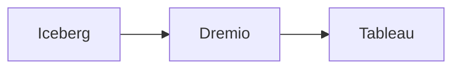

## Using Iceberg Tables with Tableau

You can view Iceberg tables in Tableau using Dremio. The high level steps are.
- Connect your Iceberg Catalog to Dremio
- Connect Tableau to Dremio

## Connecting Iceberg to Dremio

If using S3, AWS Glue or Dremio Arctic as your Iceberg catalog, start a free Dremio Cloud account.

Guide to Starting a Dremio Cloud Account:
- [Video: Starting a Dremio Cloud Account](https://www.youtube.com/watch?v=hOwZLvOPhFo)
- [Video: Creating a Sonar Project](https://www.youtube.com/watch?v=njC2X71JLHM)
- [Video: Tour of the Sonar UI](https://www.youtube.com/watch?v=SNGIjQ-rzv0)
- [Video: Dremio Arctic Overview](https://www.youtube.com/watch?v=Z19iRHlXtIU)

[Docs of Supported Catalogs in Dremio Cloud](https://docs.dremio.com/cloud/supported-data-formats/iceberg/)

If using Azure, Hive, or Google Cloud then deploy Dremio Community Edition.

- [Deploying Dremio CE to Azure](https://docs.dremio.com/software/deployment/azure/azure-quickstart/)

## Connecting Dremio to Tableau

Dremio can connect to Tableau at the click of a button, watch the video below for a demonstration:

- [Video: Connecting Dremio to Tableau](https://www.youtube.com/watch?v=VJP4IG8Ng98)

[Docs on Connecting Dremio to Tableau](https://docs.dremio.com/software/client-applications/tableau/)
